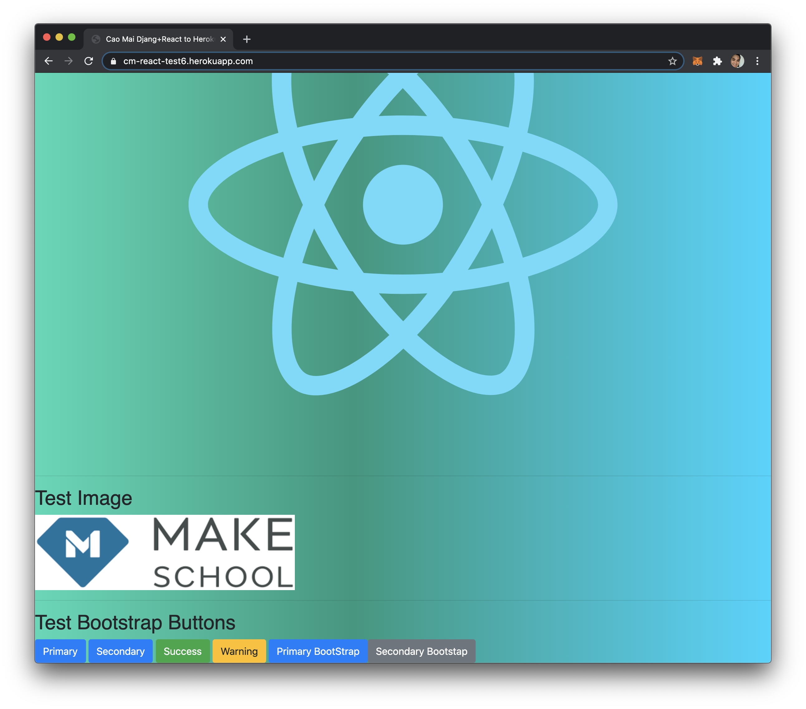

# Django+React Deployed To Heroku
This project is based on [here](https://github.com/zachtylr21/django-react-starter) which I used to modify and add the ability to view images along with text to the React app portion of the app when using a [webpack](https://webpack.js.org/).

The major achievement of this app is to deploy a Django+React project to Heroku. It is currently live on [Heroku](https://cm-react-test6.herokuapp.com/)

## Prerequisites
Must have [Django v3.1.1](https://docs.djangoproject.com/en/3.1/topics/install/) and [Node.js v12.19.0](https://nodejs.org/en/) installed, preferably in a virtual environment(virtualENV or pipENV)

## To Run Locally
Note: All bash commands should be executed at the root of this project
```
$ git clone https://github.com/caocmai/django-react-heroku.git
$ npm install
$ pip install -r requirements.txt
$ npm run dev
$ python3 manage.py runserver
```

### Screenshot (From Heroku)


## Resources Used
* [How to Serve a React Single-Page App with Django](https://dev.to/zachtylr21/how-to-serve-a-react-single-page-app-with-django-1a1l)